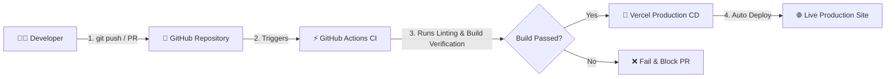

# 🎓 FresherPlacement — Career & Placement Platform for Freshers


**FresherPlacement** is a modern, full-stack placement portal built specifically for fresh graduates in India. It features real-time job listings, an interactive interview prep hub, an AI-powered career advisor, dynamic platform statistics, and a password-protected admin control panel with full CRUD capability.

---

## 🌟 Key Features

- 💼 **Live Job Board**: Search, filter by work mode (Onsite/Remote/Hybrid), tech stack, experience, and salary.
- 🎯 **Interview Prep Hub**: Structured tracks for DSA, HR questions, Aptitude, System Design, and Resume Tips.
- ❓ **Q&A Bank**: Practice real interview questions sorted by company, category, and difficulty.
- 🤖 **FresherAI Career Advisor**: AI-powered chat assistant providing personalized career and interview guidance.
- 📊 **Dynamic Statistics**: Platform stats (jobs, unique companies, interview topics, and Instagram followers) update automatically from live data.
- 🛡️ **Protected Admin Control Panel (`/admin`)**:
  - Secure authentication via Supabase Auth.
  - Full CRUD management for Jobs, Blogs, Interview Topics, and Q&A Questions.
  - One-click initial data seeding tool.

---

## 🏗️ Tech Stack & Architecture

- **Frontend**: React 19, React Router v7, Vite
- **Styling**: Vanilla CSS (Custom Design Token System, Glassmorphism, Dark/Light Mode)
- **Database**: PostgreSQL hosted on [Supabase](https://supabase.com)
- **AI Integration**: OpenRouter API (`meta-llama/llama-3-8b-instruct:free` / `gemini-2.5-flash`)
- **CI/CD Pipeline**: GitHub Actions (`.github/workflows/ci-cd.yml`) + Vercel Auto-Deployment

---

## 🔄 CI/CD & Development Lifecycle

This project follows an automated **Continuous Integration & Continuous Deployment (CI/CD)** workflow:



### Development Branch Strategy
1. **`main`**: Production-ready branch. Every push to `main` triggers automated CI testing and deploys directly to production on Vercel.
2. **`feature/<feature-name>`**: Create feature branches for new modules or bug fixes.
3. **Pull Requests**: Submit PRs to `main`. GitHub Actions runs automated code quality checks before merging.

---

## 🗄️ Database Setup (Supabase PostgreSQL)

Run the following DDL in your **Supabase SQL Editor**:

```sql
-- Enable RLS on all tables
ALTER TABLE jobs ENABLE ROW LEVEL SECURITY;
ALTER TABLE blogs ENABLE ROW LEVEL SECURITY;
ALTER TABLE interview_categories ENABLE ROW LEVEL SECURITY;
ALTER TABLE interview_topics ENABLE ROW LEVEL SECURITY;
ALTER TABLE interview_questions ENABLE ROW LEVEL SECURITY;

-- Public READ access
CREATE POLICY "Public read jobs" ON jobs FOR SELECT USING (true);
CREATE POLICY "Public read blogs" ON blogs FOR SELECT USING (true);
CREATE POLICY "Public read categories" ON interview_categories FOR SELECT USING (true);
CREATE POLICY "Public read topics" ON interview_topics FOR SELECT USING (true);
CREATE POLICY "Public read questions" ON interview_questions FOR SELECT USING (true);

-- Authenticated Admin WRITE access
CREATE POLICY "Admin write jobs" ON jobs FOR ALL TO authenticated USING (true);
CREATE POLICY "Admin write blogs" ON blogs FOR ALL TO authenticated USING (true);
CREATE POLICY "Admin write categories" ON interview_categories FOR ALL TO authenticated USING (true);
CREATE POLICY "Admin write topics" ON interview_topics FOR ALL TO authenticated USING (true);
CREATE POLICY "Admin write questions" ON interview_questions FOR ALL TO authenticated USING (true);
```

---

## ⚙️ Environment Variables Setup

Create a `.env` file in the root directory (never commit `.env` to Git):

```env
VITE_OPENROUTER_API_KEY=your_openrouter_api_key
VITE_SUPABASE_URL=https://your-project.supabase.co
VITE_SUPABASE_ANON_KEY=your_supabase_anon_key
```

On **Vercel** (or your hosting platform), add the exact same environment variables under **Project Settings → Environment Variables**.

---

## 🛠️ Local Development

```bash
# 1. Clone repository
git clone https://github.com/vidhyasagar12/fresher-placement.git
cd fresher-placement

# 2. Install dependencies
npm install

# 3. Start local development server
npm run dev

# 4. Build for production
npm run build

# 5. Run linter
npm run lint
```

---

## 📄 License

This project is open-source and available under the [MIT License](LICENSE).
